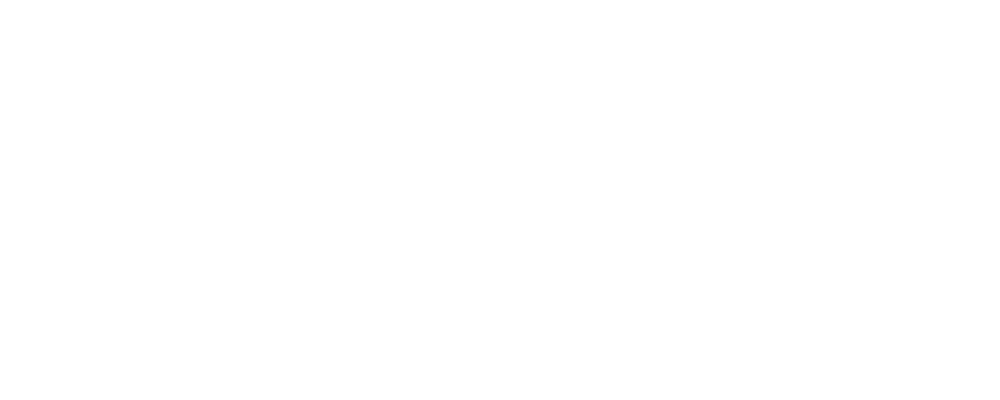

  

## About The Project

RFLOCK is a simple Arduino group project for SSK3102-2 Embedded Systems Programming. The objective of this project is to design and program a locking system which is operable via RFID (Radio Frequency IDentification). 

 

The components used in this project are:
* Arduino UNO R3 board
* MFRC522 RFID reader
* RFID cards and tags
* 16x2 LCD display
* SG90 servo motor
* 630/200 breadboard
* Pushbutton
* Green LED
* Red LED
* Piezo buzzer
* 3x 220Ω resistors
* Connecting wires

 

Currently, the locking system has the following features:
* Locking and unlocking via RFID
* Registration of new RFID tags
* Manual override button for unlocking

 

More features may be implemented in the future.

 

## Project Members

| Name | Matric Number |
|:-----------------------------:|:--------------------------:|
| [Warren Carvalho](https://github.com/Freezanator) | 206570 |
| [Syahid Hasenan](https://github.com/SyahSyahid)   | 208327 |
| Faiz Maznan                                       | 207999 |
| [Aiman Shahrel](https://github.com/Eyeman420)     | 205774 |
| [Faiz Zainuddin](https://github.com/Faxz36)       | 205456 |
